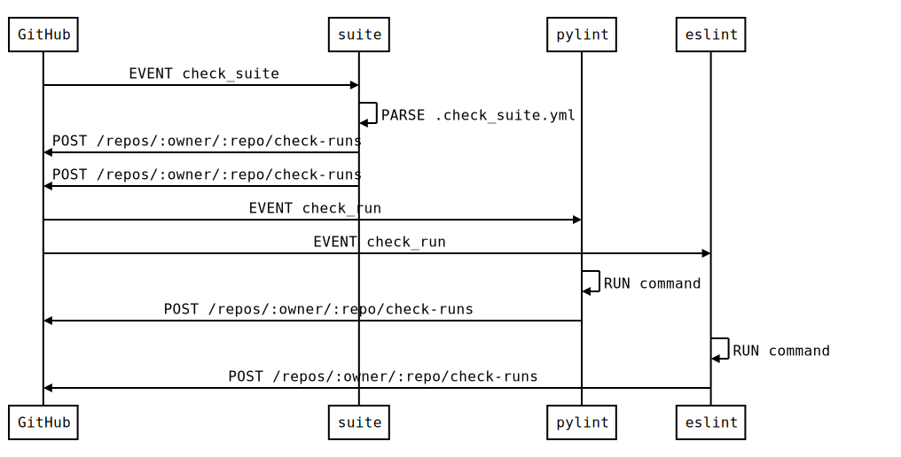

# lintipy

AWS Lambda handlers for GitHub events wrapped in SNS messages.

### How it works



The services is designed following [event-driven architecture][EDA].
It is solely based upon AWS services. Namely AWS Lambda as event consumers and emitters as well as consumers and AWS SNS as channels.

The exchange of events between AWS and GitHub is done using [CRUD][CRUD] HTTP methods. Events coming from GitHub are transferred to SNS using a small API Gateway service called [github-webhook-lambda](https://github.com/LambdaLint/github-webhook-lambda). This part is not displayed in the sequence diagram above. Essentially each event coming from GitHub forwarded to a SNS. The topic of the SNS event is the same as the GitHub event type.

Note that the check suite does not interact directly with the check runs nor via SNS. We rely on GitHub to trigger the correct events. This means that initial running of a check or rerunning it using the GitHub interface are treated identically.

[EDA]: https://en.wikipedia.org/wiki/Event-driven_architecture
[CRUD]: https://en.wikipedia.org/wiki/Create,_read,_update_and_delete

## Usage

```python
from lintipy import CheckRun

handle = CheckRun.as_handler('PEP8', 'pycodestyle', '.')
```

## See also:

This package is used on [Lambda Lint](https://lambdalint.github.io)
